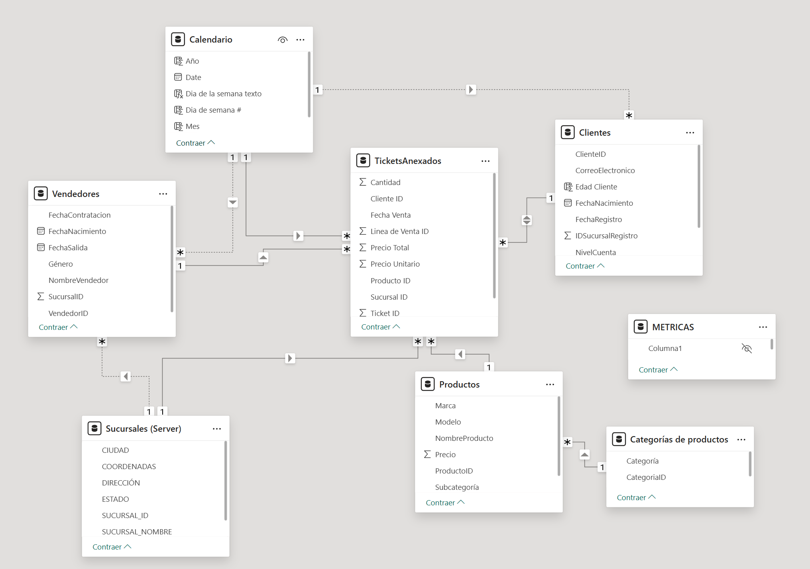
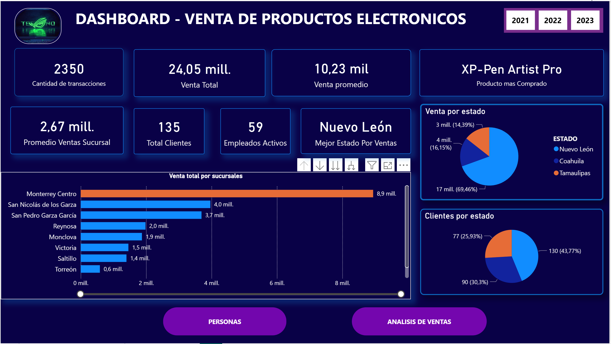
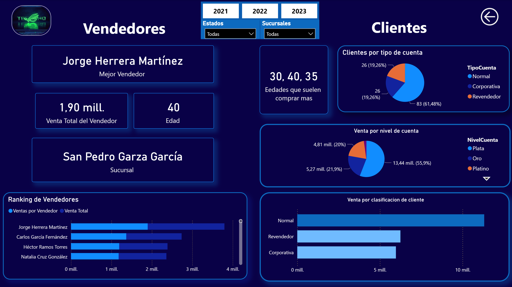
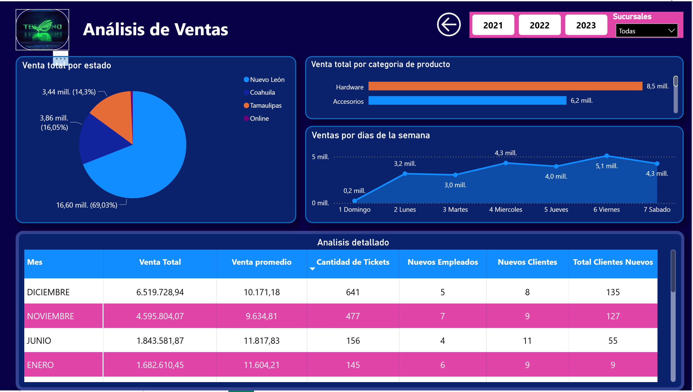

# 🎮 Dashboard de Business Intelligence: Análisis de Ventas y Eficiencia Operativa (2021-2023)

## 📋 Resumen del Proyecto
Este proyecto consiste en el desarrollo de un ecosistema integral de Business Intelligence diseñado para analizar el rendimiento comercial y operativo de una tienda del **sector gamer**. 

El objetivo principal fue cruzar los datos de ventas con el desempeño individual del equipo comercial a lo largo de tres años (2021-2023). A través de la **consolidación y normalización de datos** provenientes de múltiples fuentes, se logró procesar un volumen de más de **2.200 tickets** que representan **$24 millones en ventas**, transformando datos crudos en insights estratégicos.

## 🛠️ Stack Técnico
* **Data Source:** Microsoft Excel (datasets anuales 2021, 2022, 2023).
* **ETL & Data Cleaning:** Power Query (Lenguaje M).
* **Modelado de Datos:** Esquema en Estrella (Star Schema).
* **Visualización y Métricas:** Power BI Desktop con lenguaje DAX avanzado.

## ⚙️ Procesamiento de Datos y Desafíos ETL
El ciclo de vida del dato requirió una limpieza exhaustiva para asegurar la calidad de las métricas finales:
* **Consolidación Masiva:** Anexado dinámico de tablas de diferentes periodos anuales, asegurando la consistencia de tipos de datos en todo el histórico.
* **Integridad Referencial:** Implementación de lógica en Lenguaje M para la inyección de registros "comodín" (ej. *ID 99 - Venta Online*). Esto resolvió el problema de registros huérfanos en las sucursales y eliminó los valores "(En blanco)" en los reportes.
* **Normalización y Limpieza:** Tratamiento de valores nulos, limpieza de strings y caracteres especiales en dimensiones clave (Sucursales y Clientes).
* **Estructuración:** Separación de columnas para valores monovalentes/atómicos, generación de IDs únicos y creación de una tabla Calendario robusta para la inteligencia de tiempo.

## 📊 Métricas y Análisis Destacados
La creación de medidas avanzadas con DAX permitió profundizar en las siguientes áreas:
* **Eficiencia del Equipo Comercial:** Evaluación de **57 vendedores**, estableciendo un ranking de performance que permitió identificar al *Top Performer* del periodo, quien logró **$1.9M facturados**.
* **Comportamiento del Cliente:** Clasificación estratégica por nivel de cuenta (Plata, Oro, Platino) y tipo de cliente (Normal, Corporativa, Revendedor).
* **Venta por Temporalidad:** Análisis comparativo del flujo de tickets por día de la semana, mes y año para detectar picos de demanda estacionales.

## 📸 Vista del Proyecto 

 

 

 

## 🤖 Uso de IA y Eficiencia 
Para optimizar el ciclo de desarrollo y asegurar las mejores prácticas en el código, me apoyé en herramientas de IA generativa:
* **Copilot / Gemini:** Soporte en la redacción de scripts de limpieza complejos en Lenguaje M y en la estructuración de funciones DAX avanzadas.
* **Documentación:** Automatización de la documentación técnica y generación de comentarios descriptivos en el código.
* **Optimización de Consultas:** Refactorización de lógicas de extracción para mejorar el rendimiento y los tiempos de carga del modelo.

---
*Este proyecto abarca el ciclo completo del dato: desde la extracción, limpieza y modelado, hasta la entrega de valor real al negocio mediante dashboards estratégicos.*